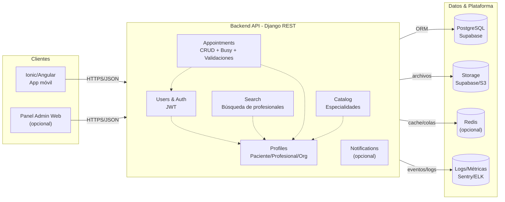
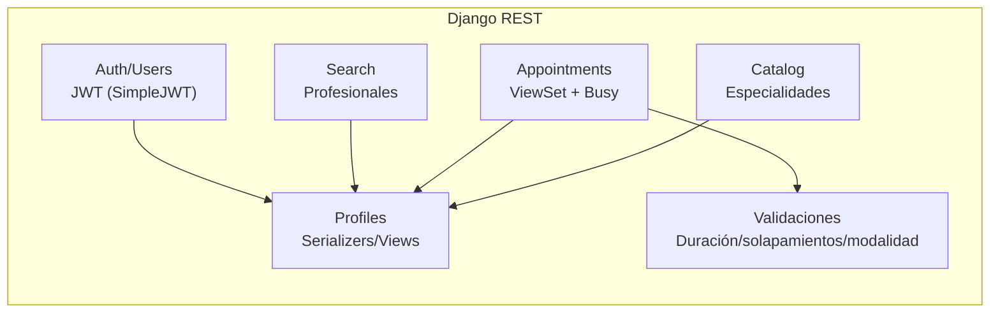

Proyecto Capstone Duoc UC sede maipú

Seccion: 703D

Docente a cargo: Daniel Alonso Montero Valenzuela

Grupo: 5

Integrantes:
Fernando Cavada, Lucas Cisternas, Joaquín Madariaga

```mermaid
flowchart LR
  subgraph Clients ["Clientes"]
    M["Ionic/Angular<br/>App móvil"]
    A["Panel Admin Web<br/>(opcional)"]
  end

  subgraph API ["Backend API - Django REST"]
    direction TB
    U["Users & Auth<br/>JWT"]
    P["Profiles<br/>Paciente/Profesional/Org"]
    C["Catalog<br/>Especialidades"]
    S["Search<br/>Búsqueda de profesionales"]
    AP["Appointments<br/>CRUD + Busy + Validaciones"]
    N["Notifications<br/>(opcional)"]
  end

  subgraph Data ["Datos & Plataforma"]
    DB[("PostgreSQL<br/>Supabase")]
    ST[("Storage<br/>Supabase/S3")]
    R[("Redis<br/>(opcional)")]
    LG[("Logs/Métricas<br/>Sentry/ELK")]
  end

  M -->|HTTPS/JSON| API
  A -->|HTTPS/JSON| API

  API -->|ORM| DB
  API -->|archivos| ST
  API -->|cache/colas| R
  API -->|eventos/logs| LG

  %% Relaciones internas
  U -.-> P
  S -.-> P
  AP -.-> U
  AP -.-> P
  C -.-> P
```

```mermaid

flowchart TB
  subgraph "Django REST"
    direction TB
    Auth["Auth/Users<br/>JWT (SimpleJWT)"]
    Profiles["Profiles<br/>Serializers/Views"]
    Catalog["Catalog<br/>Especialidades"]
    Search["Search<br/>Profesionales"]
    Appointments["Appointments<br/>ViewSet + Busy"]
    Validators["Validaciones<br/>Duración/solapamientos/modalidad"]
  end

  Auth --> Profiles
  Search --> Profiles
  Appointments --> Profiles
  Appointments --> Validators
  Catalog --> Profiles

```
